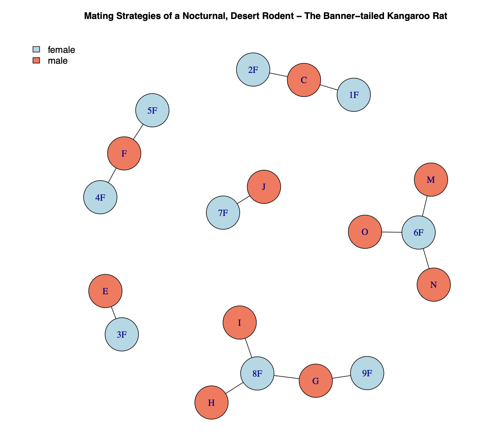
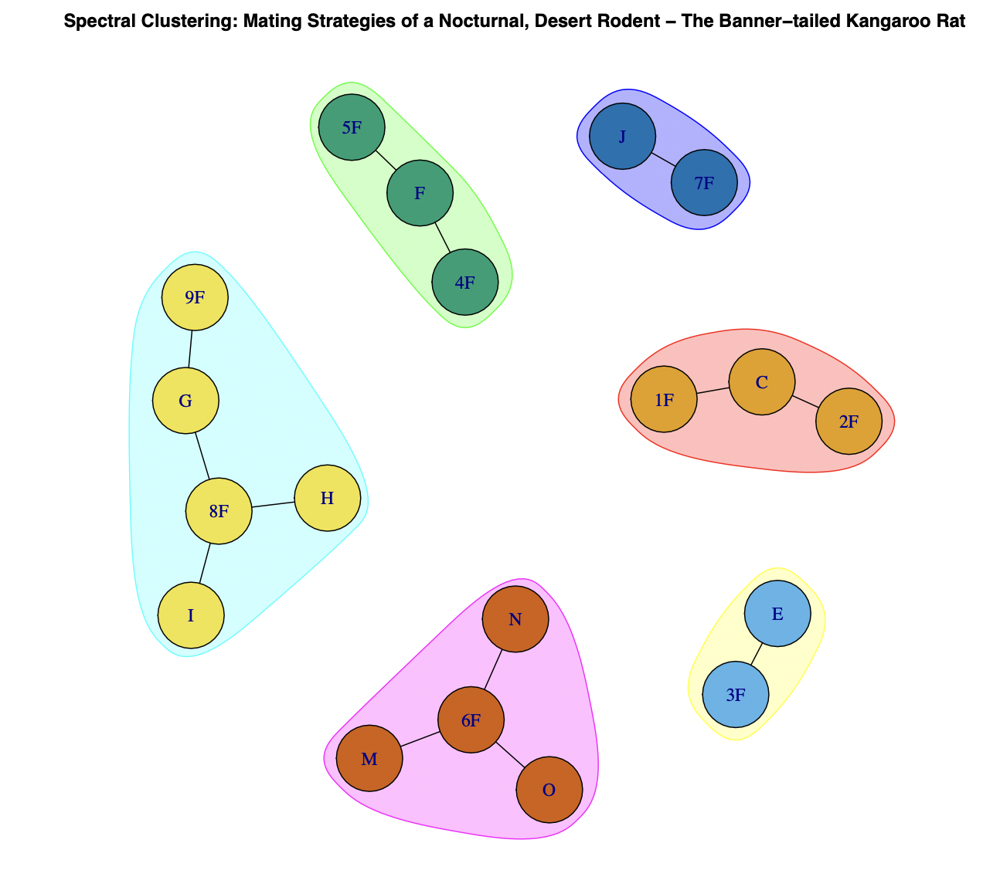

# Spectral Clustering of the Kangaroo Rat (Dipodomys Spectabilis) Mating Networks Using Eigenvectors

  
    
  <em><small>Source: The Kangaroo Rat (Dipodomys spectabilis) https://en.wikipedia.org/wiki/Kangaroo_rat#/media/File:Kangaroo-rat.jpg</small></em>

This repository contains a short script that uses simple linear algebra for spectral clustering of mating networks of the Kangaroo Rat. The script can be used for educational purposes. You can follow the code to perform spectral clustering of networks using eigenvectors step by step. 

The data used and contained in this repository was collected by Jan A. Randall as part of his study that can be found [here](https://link.springer.com/article/10.1007/BF00172173). Here are some quotes from the paper:

> The mating system of a nocturnal, desert rodent, the banner-tailed kangaroo rat (Dipodomys spectabilis) was studied through direct observation, live-trapping, and radiotelemetry over a 13-month period from August 1986 to August 1987. Mating behavior varied from exclusive matings between male and female neighbors to competitive mate searching and direct male competition.

> Study area and subjects. All matings occurred on a 150- by 240-m study site approximately 7 km northeast of Portal, Arizona, that I established in 1980 by placing numbered stakes at 15-m intervals. Mounds were identified with numbered plastic flags, and neighbor proximity was determined by measuring the distance between the base of occupied mounds. Residents were trapped with Sherman live-traps, weighed and individually marked with numbered eartags covered by color-coded reflectant tape for individual recognition at night.
Territories of 9 adult females were interspersed among those of 15 adult males in the 1986-1987 breeding season (See Fig. 1). Six of these males had resided on the study area for over a year (C, E, F, G, J, and N). Six other males were born in the spring and summer of 1986 and began to show signs of sexual maturity (descended testes) in early October (D, H, K, L, M, and O). The remaining 3 sexually mature males moved into the study area and were of unknown ages (A, B, and I). Two males (A and N) and 1 female (9) disappeared from the site during the breeding season.

I downloaded the data from [The Animal Social Structure Network Repository](https://github.com/bansallab/asnr)

### More Details

I use the `igraph` R package to read in the data and visualize it. In the graph attached below we can see that there are 6 main clusters which are separate. 

  
    
  <em><small>The Network</small></em>

  
The goal of this script is to use simple linear alegbra and find the clusters. If you follow the code you will see that the main clusters can be found by looking at the eigenvectors with the smallest non-zero eigenvalues. In those eigenvectors, the values corresponding to the individuals that form a cluster will have the same sign (positive, negative) and the individuals not taken into acount at split will have a respective value of zero. 

The final clusters can be found as a list in the `clusters` variable. 

Additionally I use the `igraph::cluster_leading_eigen()` to check if my computations were correct. I can then also plot the clusters.

  
    
  <em><small>The Clustered Netwrok</small></em>

